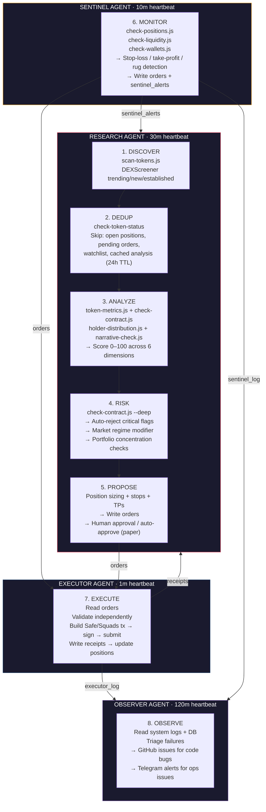
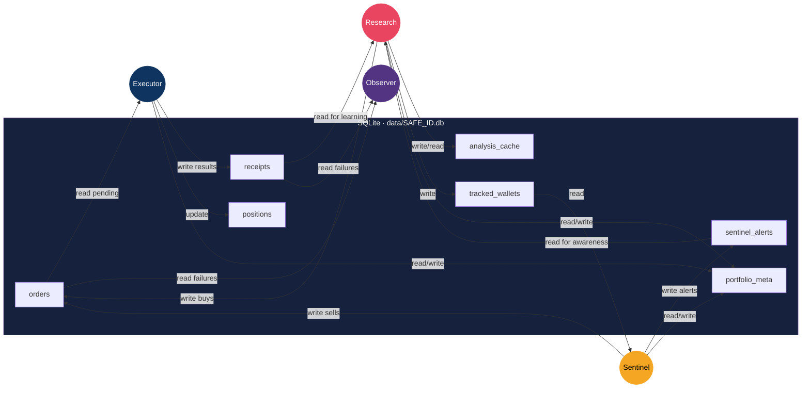

# CryptoClaw

**Four-agent crypto research & portfolio management system for [OpenClaw](https://openclaw.ai/).**

CryptoClaw turns OpenClaw into an autonomous crypto trading assistant. One agent thinks. One agent watches. One agent executes. One agent observes. Agent knowledge is shared across deployments; wallet data is isolated per fund.

## Architecture

```
                            YOU
                       (approve buys)
                             |
          +------------------+---------------+
          v                  |               v
   +-----------------+       |       +-----------------+
   |   RESEARCH      |       |       |    SENTINEL     |
   |    AGENT        |       |       |      AGENT      |
   |                 |    SQLite     |                 |
   | * Discovery     |   Database    | * Price watch   |
   | * Analysis      |   (shared)    | * LP monitor    |
   | * Risk          |       |       | * Wallet track  |
   | * Portfolio     |       |       | * Auto-sells    |
   |                 |       |       |                 |
   | GPT-5.4         |       |       | GPT-5.4         |
   |                 |       |       |   (10m)         |
   |   (30m)         |       |       |                 |
   +------+----------+       |       +-------+---------+
          |                  |               |
          v                  v               v
              orders table   |      orders table
          |                  |               |
          +------------------+---------------+
                             v
                   +----------------+
                   |   EXECUTOR     |
                   |    AGENT       |
                   |                |
                   | * Validate     |
                   | * Build tx     |
                   | * Sign         |
                   | * Submit       |
                   |                |
                   | GPT-5.4        |
                   |    (1m)        |
                   +------+---------+
                          |
                          v
                   Safe Wallet
              (policies & co-signers)

   +-----------------+
   |   OBSERVER      |
   |    AGENT        |
   |                 |
   | * Log analysis  |
   | * Failure triage|
   | * GitHub issues |
   | * Telegram alerts|
   |                 |
   | GPT-5.4         |
   |   (60m)         |
   +-----------------+
     (reads DB + logs,
      creates issues)
```

## System Overview

### Full Pipeline



### Agent Responsibility Matrix

| | Research | Sentinel | Executor | Observer |
|---|---|---|---|---|
| **Model** | GPT-5.4 | GPT-5.4 | GPT-5.4 | GPT-5.4 |
| **Heartbeat** | 30 min | 15 min | 1 min | 120 min |
| **Reads** | positions, receipts, portfolio_meta, analysis_cache, tracked_wallets | positions/paper_positions, liquidity_snapshots, tracked_wallets | orders | receipts, orders, executor_log, sentinel_log, positions |
| **Writes** | orders, trades, watchlist, tracked_wallets, analysis_cache, sentinel_alerts | orders, sentinel_alerts, liquidity_snapshots, sentinel_log | receipts, positions/paper_positions, executor_log, portfolio_meta | observer_log (+ GitHub issues, Telegram alerts) |
| **Checks** | Token safety, holder distribution, narrative strength, market regime, portfolio concentration | Price vs stops/TPs, LP changes, tracked wallet activity | Order staleness, price drift, slippage limits, balance sufficiency | Execution failures, model errors, system log errors |
| **Enforces** | Position limits, cash reserve, dedup, auto-reject rules, regime adjustments | Stop-loss, take-profit, rug detection | Independent validation, slippage caps, stale order rejection | Issue deduplication, max 3 issues/cycle, sensitive data redaction |
| **Scripts** | scan-tokens, token-metrics, check-contract, holder-distribution, narrative-check, market-overview, market-regime, portfolio-summary, score-wallet, portfolio-load-* | check-positions, check-liquidity, check-wallets | execute-trade, execute-trade-solana, check-safe-status, check-squads-status | create-issue, list-issues, send-alert, redact, log |

### Scenario Coverage

| Scenario | Handler | How |
|---|---|---|
| New trending token appears | Research | scan-tokens.js → dedup → analysis → risk → propose |
| Token already analyzed (avoid) | Research | check-token-status hits analysis_cache → skip (no redundant analysis) |
| Token is honeypot | Research | check-contract.js detects → auto-reject, cache result |
| Top holder >30% | Research | holder-distribution.js detects → auto-reject |
| Liquidity <$5k | Research | token-metrics.js detects → auto-reject |
| Pausable contract | Research | check-contract.js detects → auto-reject |
| Known scam deployer | Research | check-contract.js detects → auto-reject |
| Market turns bearish | Research | market-regime.js classifies → tighten limits (2 readings, anti-whipsaw) |
| Market crisis | Research | market-regime.js → 40% cash reserve, no new moonshots, min score 80 |
| Position hits stop-loss | Sentinel → Executor | check-positions.js → orders → execute within 1m |
| Position hits take-profit | Sentinel → Executor | check-positions.js → orders → execute within 1m |
| LP rug pull detected | Sentinel → Executor | check-liquidity.js → orders → emergency sell |
| Smart wallet dumps token | Sentinel | check-wallets.js → sentinel_alert → Research awareness |
| Price drifted >10% since proposal | Executor | Stale order check → reject, write receipt with reason |
| Slippage exceeds limit | Executor | Pre-execution validation → reject order |
| Multiple funds, same strategy | Infra | Different SAFE_ID → separate SQLite DBs, shared agent memory |
| Paper trading (no real funds) | All | PAPER_MODE=true → auto-approve buys, simulated execution, paper_* tables |
| Executor keeps failing | Observer | Reads executor_log + system.log → creates GitHub issue with root cause |
| Model errors spike | Observer | Detects pattern in system.log → sends Telegram alert to system topic |
| Agent memory survives redeploy | Infra | MEMORY.md + daily logs preserved, private git backup every 15m |
| Wallet data survives redeploy | Infra | SQLite DB preserved + auto-migrated on restart |
| Too many positions in one narrative | Research | Portfolio check → max 3 same-narrative positions |
| Portfolio over-concentrated | Research | Position limits (5% moonshot, 10% conviction, 30% base) |

### Data Flow



### Multi-Chain Support

| Capability | Base (EVM) | Solana |
|---|---|---|
| **Wallet type** | Safe multisig | Squads Protocol V4 |
| **DEX aggregator** | 1inch | Jupiter |
| **Execution script** | execute-trade-evm.js | execute-trade-solana.js |
| **Status check** | check-safe-status.js | check-squads-status.js |
| **Portfolio sync** | portfolio-load-evm.js (DeBank) | portfolio-load-solana.js (Helius) |
| **Token scanning** | DEXScreener | DEXScreener |
| **Contract safety** | GoPlus Security | GoPlus Security |
| **Wallet tracking** | Etherscan API | Solscan API |
| **Smart money scoring** | Zerion PnL | Birdeye PnL |
| **Cash token** | USDC / ETH | USDC / SOL |
| **RPC config** | RPC_BASE env var | RPC_SOL env var |
| **Signer config** | SAFE_SIGNER_KEY | SQUADS_SIGNER_KEY |

## Key Design Decisions

**Four agents, clear separation.** Research thinks deeply (GPT-5.4, handles all analysis/risk directly, 30m heartbeat). Sentinel reacts fast (GPT-5.4, 15m). Executor handles wallet operations (GPT-5.4, 1m). Observer monitors system health (GPT-5.4, 120m).

**Single model, flat fee.** All four agents run on GPT-5.4 via OpenAI Codex OAuth (ChatGPT subscription — flat fee, no per-token billing). Research handles all skills directly — no sub-agent spawning needed.

**Token deduplication.** Before running analysis, Research checks `check-token-status` against the database: open positions, pending orders, watchlist entries, and recently cached analysis results are all skipped. This prevents redundant analysis of the same trending tokens across heartbeats.

**Market regime awareness.** The system classifies market conditions (bullish, neutral, bearish, crisis) and automatically tightens position limits, raises cash reserves, and adjusts risk thresholds. In crisis mode, no new moonshot positions are allowed.

**Two-layer memory.** Agent knowledge (patterns, lessons, scoring calibration) lives in markdown files backed by a private git repo — shared across all fund deployments. Wallet data (positions, trades, orders, alerts) lives in SQLite — one database per fund, identified by `SAFE_ID`.

**Buys need approval, sells don't.** When Research proposes a buy, you get a message and must approve. When Sentinel detects danger, it writes a sell order immediately. The Executor picks it up and executes within 1 minute.

**Smart money tracking.** Interesting wallets (top holders, deployers) are proposed for background scoring via Birdeye/Zerion APIs. Wallets scoring 55+ are auto-classified as whale/smart_money and monitored for activity.

**Safe wallet for execution.** The Executor agent signs transactions via a Safe (multisig) wallet. Safe's policies decide how many signatures are needed — the agent can be one signer without being the sole authority.

**Database as message bus.** All agent-to-agent communication goes through SQLite tables via `db-query.js`. No JSON files, no direct file passing.

## Deployment Guide

### Prerequisites

- Docker and Docker Compose (for Docker path) or OpenClaw installed locally (for manual path)
- Node.js 22+ (manual path only)
- ChatGPT Plus/Pro/Team subscription (GPT-5.4 via Codex OAuth) or OpenAI API key (per-token fallback)
- A deployed Safe wallet on your target EVM chain(s) and/or Squads multisig on Solana
- RPC endpoints for each chain (Alchemy, Infura, Helius, etc.)

### Step 1: Clone and Configure

```bash
git clone https://github.com/your-org/crypto-claw.git
cd crypto-claw

cp .env.example .env
```

Edit `.env` with your values:

```bash
# Fund identity — pick a name for this deployment
SAFE_ID=fund-alpha

# LLM providers
# OPENAI_API_KEY=sk-...              # Optional fallback (per-token) — prefer Codex OAuth

# Safe wallet (EVM)
SAFE_ADDRESS_BASE=0x...              # Your Safe address on Base
SAFE_SIGNER_KEY=0x...                # Private key for one Safe signer (NEVER commit this)

# Squads multisig (Solana) — set vault address OR multisig PDA
SQUADS_VAULT_ADDRESS=...             # Your Squads vault address (base58)
SQUADS_MULTISIG_ADDRESS=...          # Or multisig PDA — vault derived from this
SQUADS_SIGNER_KEY=...                # Signer private key (base58, NEVER commit this)

# Active chains (default: base)
ACTIVE_CHAINS=base,ethereum,solana

# RPC endpoints
RPC_BASE=https://base-mainnet.g.alchemy.com/v2/YOUR_KEY
RPC_SOL=https://mainnet.helius-rpc.com/?api-key=YOUR_KEY

# Data APIs (optional but recommended)
GOPLUS_API_KEY=                       # Contract safety checks
ETHERSCAN_API_KEY=                    # EVM wallet tracking
HELIUS_API_KEY=                       # Solana portfolio sync + token data
```

### Step 2: Deploy

#### Option A: Docker (Recommended)

```bash
docker compose up -d
docker compose logs -f    # watch startup
```

What happens on first start:

1. Image builds: installs OpenClaw, deploys four agents, installs npm dependencies
2. `entrypoint.sh` runs: seeds workspace files (USER.md, MEMORY.md, TOOLS.md, etc.)
3. SQLite database created and migrated (`data/<SAFE_ID>.db` — 20 tables)
4. Background loops start: memory backup (15m), wallet scoring (10m), sentinel (15m), executor (1m)
5. OpenClaw gateway starts, cron jobs created: research (30m), observer (60m)

#### Option B: Manual (No Docker)

```bash
chmod +x setup.sh
SAFE_ID=fund-alpha ./setup.sh

# Optional: install memory backup + wallet scoring cron jobs
SAFE_ID=fund-alpha ./setup.sh --memory-backup --wallet-scorer
```

### Paper Mode (Simulated Trading)

Run the full system autonomously without touching real funds:

```bash
# Docker
PAPER_MODE=true docker compose up -d

# With custom starting balance
PAPER_MODE=true PAPER_STARTING_BALANCE=5000 docker compose up -d
```

In paper mode:
- BUY proposals that pass all safety checks are auto-approved (`approved_by: 'paper_mode'`)
- No human approval needed — fully autonomous
- All safety rules remain enforced
- Trades recorded in `paper_receipts` and `paper_positions` tables
- Use `get-paper-portfolio`, `get-paper-stats`, etc. for paper-specific queries

### Model Configuration

```bash
# Default: All agents on GPT-5.4 via Codex OAuth (flat fee)
RESEARCH_MODEL=openai-codex/gpt-5.4
SENTINEL_MODEL=openai-codex/gpt-5.4
EXECUTOR_MODEL=openai-codex/gpt-5.4
OBSERVER_MODEL=openai-codex/gpt-5.4
```

### Step 3: Configure Your Profile

Edit `USER.md` in the research agent's workspace:

```bash
# Docker: exec into the container
docker compose exec crypto-claw nano /home/openclaw/.openclaw/agents/research/workspace/USER.md

# Manual
nano ~/.openclaw/agents/research/workspace/USER.md
```

Fill in your timezone, experience level, risk tolerance, portfolio targets, and any wallet addresses you want tracked.

### Step 4: Set Up Agent Memory Backup

Agent memory (MEMORY.md + daily logs) should be backed up to a **private** git repo, separate from the code repo.

```bash
# Docker: set MEMORY_GIT_REMOTE in .env
MEMORY_GIT_REMOTE=https://<token>@github.com/your-org/crypto-claw-memory.git

# Manual path
cd ~/.openclaw/agents/research/workspace
git remote add origin git@github.com:your-org/crypto-claw-memory.git
SAFE_ID=fund-alpha ./setup.sh --memory-backup
# Installs cron: commits + pushes every 15 minutes
```

### Step 5: Verify

```bash
# Run tests (offline — no API calls)
cd tests && node run-all.js --offline

# Check all 14 suites pass (537+ tests)
```

---

## Updating & Redeployment

### Docker Redeploy

```bash
git pull
docker compose up -d --build
```

What happens on restart:

1. Image rebuilds with the new code
2. `entrypoint.sh` syncs **code-owned** workspace files (TOOLS.md, BOOT.md, IDENTITY.md, agent skills, scripts)
3. **User/agent-owned** files are preserved: USER.md, MEMORY.md, daily logs
4. DB migrations run automatically — new migrations apply atomically via transactions
5. Agent models synced from env vars (picks up model changes without wiping state)

**What updates on redeploy:** agent rules, skills, scripts, TOOLS.md, BOOT.md, IDENTITY.md, DB schema.

**What persists across redeploys:** USER.md, MEMORY.md, daily logs, all wallet data (positions, trades, orders, receipts).

### Manual Redeploy

```bash
git pull
SAFE_ID=fund-alpha ./setup.sh
```

### File Ownership Model

| File | Owner | On Redeploy |
|------|-------|-------------|
| `AGENTS.md`, `SOUL.md`, `HEARTBEAT.md` | Code | Always updated |
| `skills/*/SKILL.md` | Code | Always updated |
| `scripts/*.js` | Code | Always updated |
| `TOOLS.md`, `IDENTITY.md`, `BOOT.md` | Code | Synced from templates |
| `USER.md` | User | Preserved (seed only on first deploy) |
| `MEMORY.md` | Agent | Preserved (seed only on first deploy) |
| `memory/*.md` (daily logs) | Agent | Preserved |
| `data/*.db` (SQLite) | Agent | Preserved + migrated |

---

## Operations

### Checking Status

```bash
# Docker
docker compose logs -f                        # Live logs
docker compose exec crypto-claw \
  node scripts/db-query.js get-portfolio --chain base  # Portfolio state
docker compose exec crypto-claw \
  node scripts/db-query.js get-heartbeat --agent research  # When agent last ran

# Manual
SAFE_ID=fund-alpha node scripts/db-query.js get-portfolio --chain base
SAFE_ID=fund-alpha node scripts/db-query.js get-heartbeat --agent research
```

### Common Queries

```bash
# Open positions
node scripts/db-query.js get-positions --status open

# Pending buy orders waiting for your approval
node scripts/db-query.js get-orders --pending --action buy

# Pending sell orders
node scripts/db-query.js get-orders --pending --action sell

# Recent execution receipts
node scripts/db-query.js get-receipts --limit 10

# Trade performance stats
node scripts/db-query.js get-trade-stats

# Unprocessed sentinel alerts
node scripts/db-query.js get-alerts --unprocessed

# Current market regime
node scripts/db-query.js get-meta --key market_regime

# Tracked wallets (smart money)
node scripts/db-query.js get-tracked-wallets --status scored

# Analysis cache (dedup)
node scripts/db-query.js get-analysis-cache

# Check migration status
node scripts/db-query.js migrate
```

### Paper Mode Queries

```bash
node scripts/db-query.js get-paper-portfolio --chain base  # Cash, P&L, positions
node scripts/db-query.js get-paper-positions               # Open paper positions
node scripts/db-query.js get-paper-stats --chain base      # Win rate, returns
node scripts/db-query.js get-paper-receipts --limit 10
```

### Depositing Funds

After depositing ETH/USDC to your Safe wallet, update the cash balance:

```bash
node scripts/db-query.js set-cash --chain base --amount 10000
node scripts/db-query.js set-meta --key total_deposited_base --value 10000
```

### Backing Up Wallet Data

```bash
# Docker: copy DB from volume
docker compose exec crypto-claw \
  sqlite3 /home/openclaw/.openclaw/agents/research/data/fund-alpha.db ".backup /tmp/backup.db"
docker compose cp crypto-claw:/tmp/backup.db ./backups/fund-alpha-$(date +%Y%m%d).db

# Manual: direct file copy (safe while agents run — WAL mode)
cp ~/.openclaw/agents/research/data/fund-alpha.db ./backups/
```

### Stopping and Restarting

```bash
# Docker
docker compose down          # Stop (data preserved in volumes)
docker compose up -d         # Restart

# Reset everything (DESTROYS ALL DATA)
docker compose down -v       # -v removes named volumes
docker compose up -d --build # Fresh start
```

---

## Multi-Fund Deployment

CryptoClaw supports managing multiple Safe wallets from the same codebase. Each fund gets its own SQLite database; agent memory (patterns, lessons) is shared.

```bash
# Fund A
SAFE_ID=fund-alpha docker compose up -d

# Fund B — use a separate compose project name
SAFE_ID=fund-beta docker compose -p crypto-claw-beta up -d
```

---

## Memory System

### Layer 1: Agent Memory (Markdown)

Agent knowledge that applies across all fund deployments. Backed by a **private git repo**, separate from the code repo. Backed up every 15 minutes.

| File | Purpose |
|------|---------|
| `MEMORY.md` | Curated patterns, lessons, scoring calibration (updated when pattern seen 3+ times) |
| `memory/YYYY-MM-DD.md` | Daily logs with timestamped, categorized entries |

### Layer 2: Wallet Data (SQLite)

Per-fund data in `data/<SAFE_ID>.db`. 20 tables, auto-migrating schema. Accessed via `node scripts/db-query.js` (35+ commands).

| Table | Written By | Read By | Purpose |
|-------|-----------|---------|---------|
| `positions` | Executor | All | Current positions with stops and TPs |
| `orders` | Research, Sentinel | Executor | Buy/sell order queue |
| `receipts` | Executor | All | Execution results with tx hashes |
| `sentinel_alerts` | Sentinel | Research | Monitoring alerts |
| `watchlist` | Research | Research | Tokens waiting for entry |
| `trades` | Research, Executor | Research | Trade history with stats |
| `liquidity_snapshots` | Sentinel | Sentinel | LP snapshots for comparison |
| `tracked_wallets` | Research | Research, Sentinel | Smart money addresses with scores |
| `analysis_cache` | Research | Research | Dedup cache for avoid/reject verdicts (24h TTL) |
| `heartbeat_state` | All | All | Last-run timestamps per agent |
| `sentinel_log` | Sentinel | All | Monitoring check history |
| `executor_log` | Executor | Executor | Processing history |
| `portfolio_meta` | All | All | Cash balance, safe_id, market regime |
| `paper_receipts` | Executor | All | Simulated trade records (paper mode) |
| `paper_positions` | Executor | All | Simulated positions (paper mode) |
| `portfolio_sync` | Sentinel | Sentinel | On-chain portfolio sync state |
| `contract_snapshots` | Sentinel | Sentinel | Contract safety snapshots for change detection |
| `research_log` | Research | Research | Research heartbeat check history |
| `observer_log` | Observer | Observer | Observer triage cycle history |

---

## Telegram Integration

Alerts are routed to a Telegram supergroup with per-topic threads. Each agent sends to its designated topic.

### Topic Routing

| Topic Env Var | Agent | Content |
|---|---|---|
| `TG_TOPIC_RESEARCH` | Research | Discoveries, trade proposals, analysis results |
| `TG_TOPIC_SENTINEL` | Sentinel | Stop-loss, take-profit, rug detection, LP alerts |
| `TG_TOPIC_EXECUTOR` | Executor | Execution receipts, transaction confirmations |
| `TG_TOPIC_ALERTS` | All | Critical alerts (model failure, emergency mode, rug warning) |
| `TG_TOPIC_SYSTEM` | System | Health checks, startup, recovered, heartbeat summary |
| `TG_TOPIC_OBSERVER` | Observer | Observer triage results, system health checks |
| `TG_TOPIC_PORTFOLIO` | System | Daily portfolio report |

### Security

`TELEGRAM_OWNER_ID` restricts owner-only commands (like approve/reject) to a single Telegram user ID.

### Setup

1. Create a Telegram supergroup with topics enabled
2. Run `node scripts/telegram-get-topics.js` to discover thread IDs
3. Set the `TG_TOPIC_*` env vars in `.env`
4. Set `TELEGRAM_OWNER_ID` to your Telegram user ID

### Daily Portfolio Reports

Configure `PORTFOLIO_REPORT_HOUR` (0-23, default: 0) to receive automated daily portfolio summaries in the portfolio topic.

---

## Project Structure

```
crypto-claw/
+-- agents/
|   +-- research/                    # RESEARCH AGENT
|   |   +-- AGENTS.md                # Operating rules + buy approval logic
|   |   +-- SOUL.md                  # Research persona
|   |   +-- HEARTBEAT.md             # 30min rotating checks
|   |   +-- TOOLS.md                 # Per-agent CLI usage guide
|   |   +-- skills/
|   |       +-- discovery/SKILL.md   # Token scanning + dedup
|   |       +-- analyst/SKILL.md     # Scoring framework
|   |       +-- risk/SKILL.md        # Safety checks
|   |       +-- portfolio/SKILL.md   # Position management
|   |       +-- orders/SKILL.md      # Order management via chat
|   |
|   +-- sentinel/                    # SENTINEL AGENT
|   |   +-- AGENTS.md                # Monitoring rules + sell order logic
|   |   +-- SOUL.md                  # Watchdog persona
|   |   +-- HEARTBEAT.md             # 10min all checks
|   |   +-- TOOLS.md                 # Per-agent CLI usage guide
|   |   +-- skills/
|   |       +-- sentinel/SKILL.md    # Position monitoring
|   |
|   +-- executor/                    # EXECUTOR AGENT
|   |   +-- AGENTS.md                # Transaction rules + validation logic
|   |   +-- SOUL.md                  # Mechanical persona
|   |   +-- HEARTBEAT.md             # 1min order processing
|   |   +-- TOOLS.md                 # Per-agent CLI usage guide
|   |   +-- skills/
|   |       +-- executor/SKILL.md    # Safe wallet tx building
|   |
|   +-- observer/                    # OBSERVER AGENT
|       +-- AGENTS.md                # Triage rules + issue creation logic
|       +-- SOUL.md                  # Watchful persona
|       +-- HEARTBEAT.md             # 120min triage cycle
|       +-- TOOLS.md                 # Per-agent CLI usage guide
|       +-- skills/
|           +-- triage/SKILL.md      # Log analysis + GitHub issues
|
+-- workspace/                       # SHARED (copied to all agents)
|   +-- USER.md                      # Your profile (preserved on redeploy)
|   +-- IDENTITY.md                  # Agent identity
|   +-- TOOLS.md                     # Script + db-query.js usage guide
|   +-- BOOT.md                      # First-run setup
|   +-- MEMORY.md                    # Curated long-term memory (preserved)
|   +-- memory/                      # Daily logs (preserved)
|
+-- scripts/                         # NODE.JS SCRIPTS
|   +-- db.js                        # SQLite schema + migrations (20 tables)
|   +-- db-query.js                  # CLI interface for wallet data (35+ commands)
|   +-- package.json                 # Dependencies (better-sqlite3, dotenv)
|   +-- scan-tokens.js               # DEXScreener trending/new/established
|   +-- token-metrics.js             # Detailed token data
|   +-- check-contract.js            # GoPlus safety scan
|   +-- check-positions.js           # Current prices vs stops/TPs
|   +-- check-liquidity.js           # LP change detection
|   +-- check-wallets.js             # Multi-chain wallet activity tracking
|   +-- score-wallet.js              # Smart money scoring via Birdeye/Zerion
|   +-- score-wallets-bg.js          # Background wallet scoring pipeline
|   +-- market-overview.js           # BTC dominance, fear/greed
|   +-- market-regime.js             # Market regime classification + adjustments
|   +-- heartbeat-check.js           # Pre-check for background loops
|   +-- portfolio-summary.js         # Allocation + P&L
|   +-- portfolio-load-evm.js        # On-chain portfolio sync (EVM via DeBank)
|   +-- portfolio-load-solana.js     # On-chain portfolio sync (Solana via Helius)
|   +-- chains.js                    # Centralized chain config (single source of truth)
|   +-- execute-trade-evm.js             # Safe wallet swap execution (EVM)
|   +-- execute-trade-solana.js      # Squads/Jupiter swap execution (Solana)
|   +-- check-safe-status.js         # Safe wallet status check (EVM)
|   +-- check-squads-status.js       # Squads multisig status check (Solana)
|   +-- narrative-check.js           # Narrative momentum
|   +-- narrative-config.js          # Narrative definitions and tier affinities
|   +-- narrative-deep-scan.js       # Deep narrative analysis
|   +-- holder-distribution.js       # Top holder analysis
|   +-- process-order.js             # Atomic order processing with status workflow
|   +-- emergency-sentinel.js        # Emergency sentinel activation on failures
|   +-- emergency-executor.js        # Emergency executor activation on failures
|   +-- track-multisig.js            # Multisig approval workflow tracking
|   +-- send-alert.js                # Telegram alerts via openclaw message send
|   +-- redact.js                    # Sensitive data redaction (shared module)
|   +-- log.js                       # Structured logging helper
|   +-- create-issue.js              # GitHub issue creation (Observer agent)
|   +-- list-issues.js               # GitHub issue listing (Observer dedup)
|   +-- telegram-get-topics.js       # Setup helper: discover supergroup topic IDs
|   +-- memory-backup.sh             # Git auto-commit for agent memory
|   +-- codex-login.sh               # One-time Codex OAuth login
|
+-- tests/                           # 14 TEST SUITES
|   +-- run-all.js                   # Test runner
|   +-- test-helpers.js              # Minimal test framework
|   +-- test-memory.js               # Agent memory + SQLite schema + CRUD
|   +-- test-safety.js               # Safety rules + regime adjustments
|   +-- test-pipeline.js             # Pipeline integration + dedup + Solana
|   +-- test-executor.js             # Executor validation + cross-chain cash
|   +-- test-paper-mode.js           # Paper trading lifecycle + per-chain cash
|   +-- test-e2e-paper.js            # End-to-end paper trading + multi-chain
|   +-- test-e2e-real.js             # End-to-end real trading
|   +-- test-regime.js               # Market regime classification + anti-whipsaw
|   +-- test-chains.js               # Chain config + portfolio sync
|   +-- test-execution.js            # Trade execution flow
|   +-- test-emergency.js            # Emergency sentinel/executor activation
|   +-- test-telegram.js             # Telegram alerts + topic routing
|   +-- test-scripts.js              # Script output validation (needs network)
|   +-- test-process-order.js        # Order processing lifecycle (needs network)
|   +-- test-observer.js             # Observer agent + redaction + GitHub integration
|
+-- entrypoint.sh                    # Docker runtime init + background loops + cron setup
+-- Dockerfile                       # Image build
+-- docker-compose.yml               # One-command deployment
+-- build-templates.sh               # Docker build-time template assembly
+-- setup.sh                         # Bare-metal installer
+-- .env.example                     # Environment variable template
+-- CLAUDE.md                        # Claude Code project guide
```

## Safety Rules (Hard-Coded)

| Rule | Limit | Enforced By |
|------|-------|------------|
| Max moonshot position | 5% | Research + Executor |
| Max conviction position | 10% | Research + Executor |
| Max base position | 30% | Research + Executor |
| Max moonshot allocation | 30% | Research |
| Min cash reserve | 10% (25% bearish, 40% crisis) | Research |
| Max same-narrative positions | 3 | Research |
| Max open positions | 15 | Research |
| Auto-reject: honeypot | Always | Research |
| Auto-reject: top holder >30% | Always | Research |
| Auto-reject: liquidity <$5k | Always | Research |
| Auto-reject: pausable contract | Always | Research |
| Auto-reject: known scam deployer | Always | Research |
| Stop-loss auto-sell | Immediate | Sentinel -> Executor |
| Take-profit auto-sell | Immediate | Sentinel -> Executor |
| Rug warning auto-sell | Immediate | Sentinel -> Executor |
| Slippage limit (moonshot) | 5% | Executor |
| Slippage limit (conviction/base) | 2% | Executor |
| Stale order protection | 10% price drift | Executor |

### Market Regime Adjustments (Can Only Tighten)

| Parameter | Bullish/Neutral | Bearish | Crisis |
|-----------|----------------|---------|--------|
| Min cash reserve | 10% | 25% | 40% |
| Max moonshot position | 5% | 3% | 0% (no new) |
| Max conviction position | 10% | 7% | 5% |
| Base tier buying | Enabled | Paused | Paused |
| Min buy score | 50 | 65 | 80 |

Anti-whipsaw: regime only changes after 2 consecutive consistent readings.

## Tests

```bash
# Run all tests (offline — no API calls needed)
cd tests && node run-all.js --offline

# Run all tests including API-dependent script tests
cd tests && node run-all.js

# Run individual suites
node tests/test-memory.js        # Agent memory + SQLite schema + CRUD (82 tests)
node tests/test-safety.js        # Safety rules + regime limits (46 tests)
node tests/test-pipeline.js      # Pipeline + dedup + Solana (57 tests)
node tests/test-executor.js      # Validation, slippage, receipts, cross-chain (42 tests)
node tests/test-paper-mode.js    # Paper trading lifecycle + per-chain cash (22 tests)
node tests/test-e2e-paper.js     # End-to-end paper trading + multi-chain (49 tests)
node tests/test-e2e-real.js      # End-to-end real trading (53 tests)
node tests/test-regime.js        # Regime classification + anti-whipsaw (57 tests)
node tests/test-chains.js        # Chain config + portfolio sync (50 tests)
node tests/test-execution.js     # Trade execution flow (38 tests)
node tests/test-emergency.js     # Emergency sentinel/executor activation (19 tests)
node tests/test-telegram.js      # Telegram alerts + topic routing (22 tests)
node tests/test-scripts.js       # Script output format (needs network)
node tests/test-process-order.js # Order processing lifecycle (needs network)
node tests/test-observer.js      # Observer agent + redaction + GitHub integration
```

## Cost Optimization

- All four agents run on **GPT-5.4** via Codex OAuth (ChatGPT subscription — flat fee)
- All agents use **GPT-5.4** — single model, no sub-agent overhead
- **Token dedup** prevents redundant analysis of already-analyzed tokens
- **Background loops** (sentinel, executor) with pre-checks skip agent invocation when nothing is pending
- **Cron jobs** (research 30m, observer 60m) with overlap guards prevent concurrent runs
- Scripts handle ALL API calls — LLM never fetches data directly
- Sentinel/Executor context stays minimal when portfolio is healthy or no orders pending
- Observer only runs when `OBSERVER_ISSUES_REPO` and `GH_TOKEN` are configured

## License

MIT

## Disclaimer

CryptoClaw is experimental software. Cryptocurrency trading involves substantial risk. This is not financial advice. Always do your own research. Never invest more than you can afford to lose.
